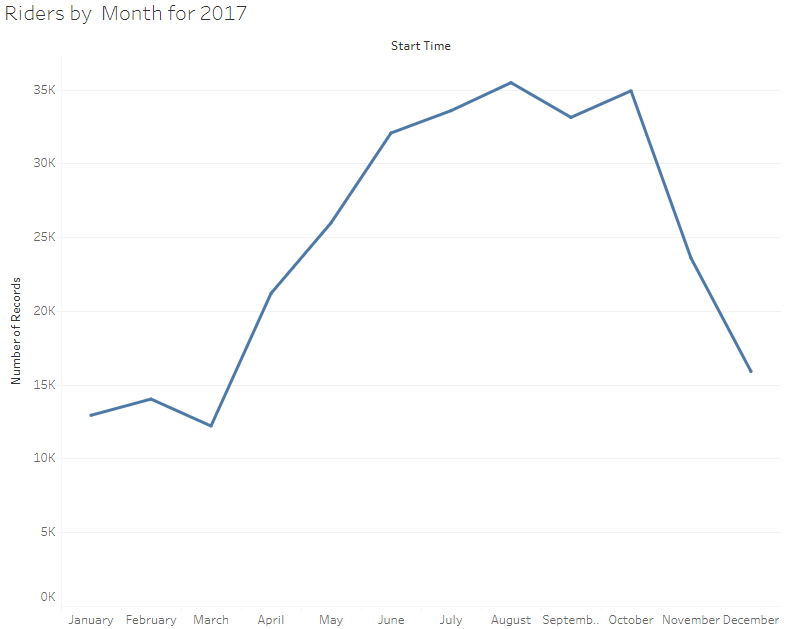
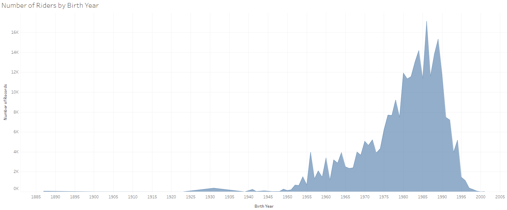
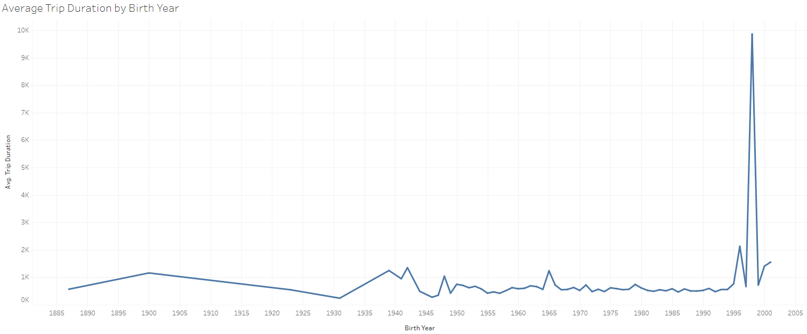
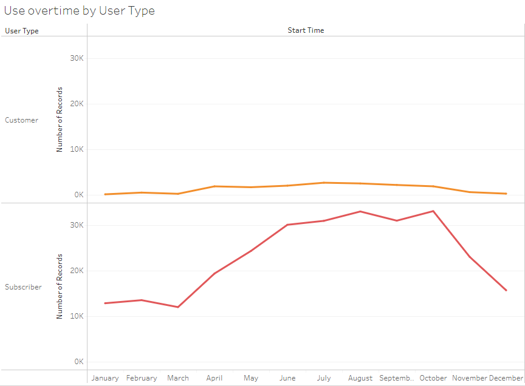
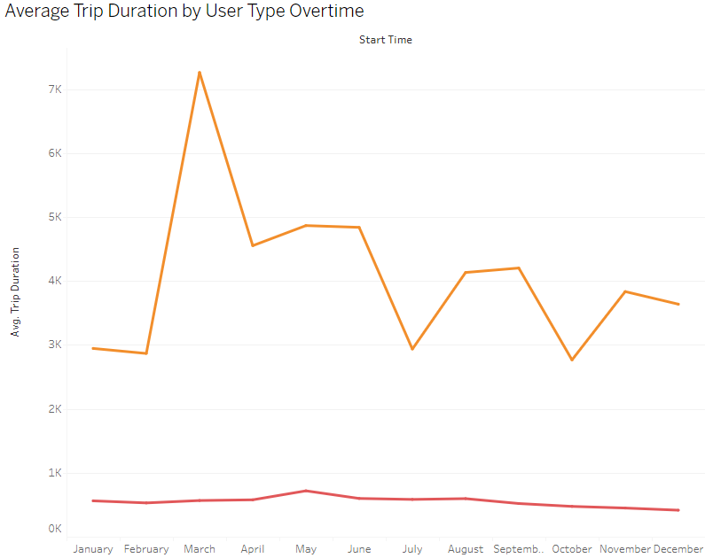

# Citi-Bike-Analytics
Since 2013, the Citi Bike Program in New York City has implemented a robust infrastructure for collecting data on the program's utilization. Each month the bike data is collected, organized, and made public on the Citi Bike Data webpage.

# Objective
The goal of this project is to aggregate the data found in the Citi Bike Trip History Logs to create visualizations. The timespan that is used for this data is the year 2017.

# Resources
[Citi Bike Data](https://ride.citibikenyc.com/system-data)

[Tableau](https://public.tableau.com/en-us/s/)

# Data Cleaning
Before doing any visualizations, Python and the Pandas library was used to clean the data. In a Jupyter Notebook, the monthly data files were concatenated into one. 

# Visualizations
https://public.tableau.com/app/profile/sally8437/viz/CitiBikeAnalytics_16566437891540/CitiBikeAnalytics-JerseyCityNJ- 

# Analysis
The number of riders is higher during summer and fall, which can be due to the nice weather. 

The most popular/ top 10 start and end stations can mostly be found in New Jersey zipcode 07302 since this area is mostly residential homes and most of the roads have bike lanes.

The bottom 10 start stations are more spread out throughout 3 different zip codes, while the bottom 10 end stations are spread out throughout several zip codes because these zip codes are very close to each other and their roads have bike lanes, which allows riders to easily bike from one zip code to another.

In addition, people born between 1980 and 2000 represent the highest number of riders. However, people born after 1990 have a higher average trip duration. This can mean that younger riders enjoy riding the Citi bike more; they have more energy to ride it for a longer period, and use it to help them to get to places they need to go, such as going to work/ school, grocery shopping, and spending time with family and friends. 

Even though there are more subscribers than customers, customers have a higher average trip duration than subscribers. This could signal a growing interest in short-term rentals for users who want to experience the CitiBike product without having to commit for a whole year, or perhaps even a growing tourist market.

Overall, there is steady ridership growth across user types, suggesting a healthy demand for CitiBikes. Current year-to-date growth rates also suggest a growing market for short-term rentals. Therefore, recommendations would be to focus marketing campaigns towards those users.
